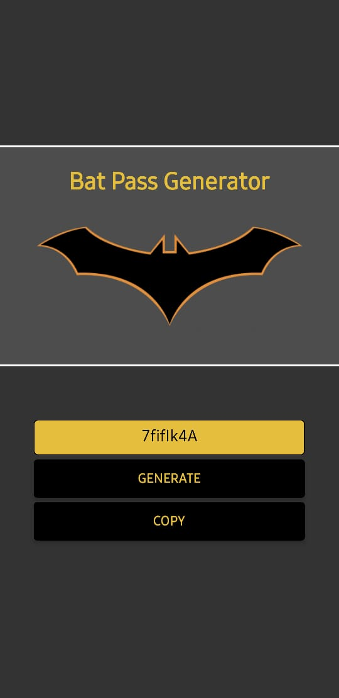

<div align="center">
  <a href="#">
      
  </a>
</div>

# Bat-Sequencer: Gerador de Senhas do Batman

Bem-vindo ao **Bat-Sequencer**, um aplicativo inovador em React Native que simula um sequenciador de senhas do Batman. Com um design intuitivo e funcionalidades interativas, este app permite a geração de senhas personalizadas com a estética sombria e tecnológica do universo do Cavaleiro das Trevas.

## 🦇 Visão Geral

Este projeto foi desenvolvido como um laboratório de estudos em React Native, com o objetivo de criar uma ferramenta funcional e visualmente atraente. O Bat-Sequencer não é apenas um gerador de senhas, mas uma imersão na atmosfera de Gotham City, onde cada senha gerada parece ter sido criada pelo próprio Batman.

## ✨ Funcionalidades

* **Geração Personalizada:** Crie senhas fortes.
* **Interface Temática:** Design inspirado no universo do Batman, com cores, ícones e fontes que remetem à tecnologia do herói.
* **Interatividade:** Componentes e feedback tátil para uma experiência de usuário mais rica.
* **Cópia Rápida:** Copie a senha gerada para a área de transferência com um único toque.
* **Simplicidade:** Uma interface limpa e direta para gerar senhas de forma rápida e eficiente.

## 🚀 Tecnologias Utilizadas

Este projeto foi construído utilizando as seguintes tecnologias:

* [**React Native**](https://reactnative.dev/) - Framework para desenvolvimento de aplicativos móveis multiplataforma.
* [**Expo**](https://expo.dev/) - Plataforma para facilitar o desenvolvimento e a implantação de apps React Native.
* [**JavaScript/TypeScript**](https://www.typescriptlang.org/) - Linguagem de programação principal.
* Componentes customizados para a interface.

## 🛠️ Começando

Para executar este projeto localmente, siga os passos abaixo.

### Pré-requisitos

Você precisará ter o [Node.js](https://nodejs.org/) (versão 18 ou superior) e o [Yarn](https://yarnpkg.com/) (ou npm) instalados em sua máquina. Além disso, é necessário ter o ambiente de desenvolvimento React Native configurado.

Recomenda-se o uso do Expo Go no seu smartphone para uma experiência de desenvolvimento mais fluida.

### Instalação

1.  **Clone o repositório:**
    ```sh
    git clone https://github.com/dsanchezsantos/bat-pass-app
    ```

2.  **Acesse o diretório do projeto:**
    ```sh
    cd bat-pass-app
    ```

3.  **Instale as dependências:**
    ```sh
    # npm install
    ```

## ▶️ Uso

Com o ambiente configurado e as dependências instaladas, você pode iniciar o aplicativo.

1.  **Inicie o servidor de desenvolvimento:**
    ```sh
    # npm expo start
    ```
2.  **Execute em seu dispositivo:**
    * **iOS:** Abra o aplicativo Câmera e escaneie o QR code exibido no terminal.
    * **Android:** Use o aplicativo Expo Go para escanear o QR code.

O servidor de desenvolvimento do Metro Bundler será iniciado e você poderá visualizar o aplicativo em seu dispositivo ou em um emulador.

## 🖼️ Telas do App

| Tela Principal |
| :---: |
|  |

## 🤝 Contribuições

Contribuições são o que tornam a comunidade de código aberto um lugar incrível para aprender, inspirar e criar. Qualquer contribuição que você fizer será **muito apreciada**.

Se você tiver uma sugestão para melhorar este projeto, por favor, crie um fork do repositório e abra um pull request. Você também pode simplesmente abrir uma issue com a tag "enhancement".

1.  Faça um Fork do projeto
2.  Crie sua Feature Branch (`git checkout -b feature/AmazingFeature`)
3.  Faça o Commit de suas alterações (`git commit -m 'Add some AmazingFeature'`)
4.  Faça o Push para a Branch (`git push origin feature/AmazingFeature`)
5.  Abra um Pull Request

## 📝 Licença

Distribuído sob a licença MIT. Veja `LICENSE` para mais informações.

## 🙏 Agradecimentos

* Aos criadores do Batman por inspirar este universo incrível.
* À comunidade React Native por fornecer ferramentas e bibliotecas fantásticas.
